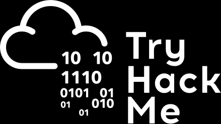
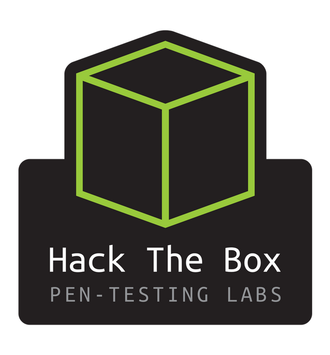

### Hi there 👋

<!--
**thibaultserti/thibaultserti** is a ✨ _special_ ✨ repository because its `README.md` (this file) appears on your GitHub profile.

Here are some ideas to get you started:

- 🔭 I’m currently working on ...
- 🌱 I’m currently learning ...
- 👯 I’m looking to collaborate on ...
- 🤔 I’m looking for help with ...
- 💬 Ask me about ...
- 📫 How to reach me: ...
- 😄 Pronouns: ...
- ⚡ Fun fact: ...
-->
# Welcome to my GitHub page!

- 🎓 Currently studying <b>Data Science and AI at Centrale Lille, France 🇫🇷</b>
- 💻 Currently working at <b>[OVHcloud](https://ovhcloud.com) as DevOps</b>

Welcome to my personal <b>GitHub</b> page! In this page I upload some of my projects that I like, in order to keep track of my work throughout the years!
I like security and data science topics and I'm very interested into the their industrialization.

I'm doing a lot of CTFs and challenges in every domain (reverse, scripting, crypto, ...)
You can find me on:

<table align="center">
    <tr>
        <td align="center"></td>
      <td align="center"><a href="https://root-me.org/thibaultserti">https://root-me.org</a></td>
    </tr>
    <tr>
        <td align="center"></td>
        <td align="center"><a href="https://cryptohack.org/user/thibaultserti">https://cryptohack.org</a></td>
    </tr>
    <tr>
        <td align="center"></td>
        <td align="center"><a href="https://tryhackme.com/p/thibaultserti)">https://tryhackme.com</a></td>
    </tr>
    <tr>
        <td align="center"></td>
        <td align="center"><a href="https://www.hackthebox.eu/home/users/profile/384113">https://hackthebox.eu</a></td>
    </tr>
    <tr>
        <td align="center"></td>
        <td align="center"><a href="https://www.newbiecontest.org/index.php?page=info_membre&id=85319">https://newbiecontest.org</a></td>
    </tr>
</table>

You can find some of my projects below!

<i>Statistics shown below:</i>

|
