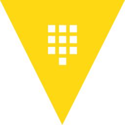

<!--
**thibaultserti/thibaultserti** is a ✨ _special_ ✨ repository because its `README.md` (this file) appears on your GitHub profile.

Here are some ideas to get you started:

- 🔭 I’m currently working on ...
- 🌱 I’m currently learning ...
- 👯 I’m looking to collaborate on ...
- 🤔 I’m looking for help with ...
- 💬 Ask me about ...
- 📫 How to reach me: ...
- 😄 Pronouns: ...
- ⚡ Fun fact: ...
-->

# Welcome to my GitHub page!

- 🎓 Graduated from <b>[Centrale Lille](https://centralelille.fr) as Data Science and AI specialist</b>
- 💻 Currently working at <b>[Skale-5](https://skale-5.com) as Cloud Architect and DevOps Engineer</b>
- 🛠️ On a mission at <b>[Adeo](https://adeo.com) as Cloud Architect and Python Developer</b>
- ⚡ Trainer for <b>[Rezoleo](https://github.com/rezoleo)</b>

Welcome to my personal <b>GitHub</b> page! In this page I upload some of my projects that I like, in order to keep track of my work throughout the years!

I like security, cloud, infrastrcture, dev and data science topics and I'm very interested into the their industrialization.

<h2>My technology stack</h2>

    
    
    
    
    

    
    
    
    
    
    
    
    

    
    
    
    
    
    
    
    

    
    
    
    
    
    

    <a href="https://traefik.io/" target="_blank"> 
    <a href="https://www.nginx.com/" target="_blank"> 

    <a href="https://www.golang.org/" target="_blank"> 
    <a href="https://www.python.org/" target="_blank"> 
    <a href="https://www.fastatpi.tiangolog.com/" target="_blank"> 
    <a href="https://www.gnu.org/software/bash/" target="_blank"> 

    
    
    
    

    
    
    

 

 

