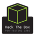

<!--
**thibaultserti/thibaultserti** is a ✨ _special_ ✨ repository because its `README.md` (this file) appears on your GitHub profile.

Here are some ideas to get you started:

- 🔭 I’m currently working on ...
- 🌱 I’m currently learning ...
- 👯 I’m looking to collaborate on ...
- 🤔 I’m looking for help with ...
- 💬 Ask me about ...
- 📫 How to reach me: ...
- 😄 Pronouns: ...
- ⚡ Fun fact: ...
-->

# Welcome to my GitHub page!

- 🎓 Graduated from <b>[Centrale Lille](https://centralelille.fr) as Data Science and AI specialist</b>
- 💻 Currently working at <b>[Skale-5](https://skale-5.com) as Cloud Architect and DevOps Engineer</b>
- ⚡ Trainer for <b>[Rezoleo](https://github.com/rezoleo)</b> 

Welcome to my personal <b>GitHub</b> page! In this page I upload some of my projects that I like, in order to keep track of my work throughout the years!
I like security, ops and data science topics and I'm very interested into the their industrialization.

I am a [Professional Google Certified Architect](https://cloud.google.com/certification/cloud-architect), a [Terraform Associate](https://www.hashicorp.com/certification/terraform-associate), a [Kubernetes Certified Administrator](https://www.cncf.io/certification/cka/), [Kubernetes Certified Application Developer](https://www.cncf.io/certification/ckad/) and [Kubernetes Certified Security Specialist](https://www.cncf.io/certification/cks/)

I'm also doing a lot of CTFs and challenges in every domain (reverse, scripting, crypto, ...)
You can find me on:

<table align="center">
    <tr>
        <td align="center"></td>
        <td align="center"><a href="https://root-me.org/Thibault-Serti">https://root-me.org</a></td>
        <td align="center"></td>
    </tr>
    <tr>
        <td align="center"></td>
        <td align="center"><a href="https://cryptohack.org/user/thibaultserti">https://cryptohack.org</a></td>
        <td align="center"></td>
    </tr>
    <tr>
        <td align="center"></td>
        <td align="center"><a href="https://tryhackme.com/p/thibaultserti">https://tryhackme.com</a></td>
        <td align="center"></td>
    </tr>
    <tr>
        <td align="center"></td>
        <td align="center"><a href="https://www.hackthebox.eu/home/users/profile/384113">https://hackthebox.eu</a></td>
        <td align="center"></td>
    </tr>
    <tr>
        <td align="center"></td>
        <td align="center"><a href="https://www.newbiecontest.org/index.php?page=info_membre&id=85319">https://newbiecontest.org</a></td>
        <td align="center"></td>
    </tr>
     <tr>
        <td align="center"></td>
        <td align="center"><a href="https://projecteuler.net/progress=alvin666">https://projecteuler.net</a></td>
        <td align="center"></td>
    </tr>
</table>

    
<h3> My technology stack</h3>

#### Operating System

#### Programming

#### Virtualization

#### Automation

 
#### Network

#### CI/CD
    

    
#### Monitoring

    

#### Storage

    
#### Cloud
 

    

    
<h3>Statistics shown below:</h3>

&nbsp; 
 

    
<h3>Most used languages</h3>

&nbsp; 
<a href="https://github.com/ryo-ma/github-profile-trophy" target="_blank">
     
    
</a>

    
<h3>GitHub Trophies 🏆</h3>

  

