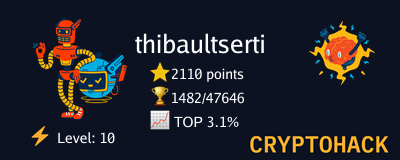

<!--
**thibaultserti/thibaultserti** is a ✨ _special_ ✨ repository because its `README.md` (this file) appears on your GitHub profile.

Here are some ideas to get you started:

- 🔭 I’m currently working on ...
- 🌱 I’m currently learning ...
- 👯 I’m looking to collaborate on ...
- 🤔 I’m looking for help with ...
- 💬 Ask me about ...
- 📫 How to reach me: ...
- 😄 Pronouns: ...
- ⚡ Fun fact: ...
-->

# Welcome to my GitHub page!

- 🎓 Graduated from <b>[Centrale Lille](https://centralelille.fr) as Data Science and AI specialist</b>
- 💻 Currently working at <b>[Skale-5](https://skale-5.com) as Cloud Architect and DevOps Engineer</b>
- ⚡ Trainer for <b>[Rezoleo](https://github.com/rezoleo)</b> 

Welcome to my personal <b>GitHub</b> page! In this page I upload some of my projects that I like, in order to keep track of my work throughout the years!
I like security and data science topics and I'm very interested into the their industrialization.

I'm doing a lot of CTFs and challenges in every domain (reverse, scripting, crypto, ...)
You can find me on:

<table align="center">
    <tr>
        <td align="center"></td>
        <td align="center"><a href="https://root-me.org/Thibault-Serti">https://root-me.org</a></td>
        <td align="center"></td>
    </tr>
    <tr>
        <td align="center"></td>
        <td align="center"><a href="https://cryptohack.org/user/thibaultserti">https://cryptohack.org</a></td>
        <td align="center"></td>
    </tr>
    <tr>
        <td align="center"></td>
        <td align="center"><a href="https://tryhackme.com/p/thibaultserti">https://tryhackme.com</a></td>
        <td align="center"></td>
    </tr>
    <tr>
        <td align="center"></td>
        <td align="center"><a href="https://www.hackthebox.eu/home/users/profile/384113">https://hackthebox.eu</a></td>
        <td align="center"></td>
    </tr>
    <tr>
        <td align="center"></td>
        <td align="center"><a href="https://www.newbiecontest.org/index.php?page=info_membre&id=85319">https://newbiecontest.org</a></td>
        <td align="center"></td>
    </tr>
     <tr>
        <td align="center"></td>
        <td align="center"><a href="https://projecteuler.net/progress=alvin666">https://projecteuler.net</a></td>
        <td align="center"></td>
    </tr>
</table>

    
<h3> My technology stack</h3>

#### Operating System

#### Programming

#### Virtualization

#### Automation

 
#### Network

[![Keepalived](https://img.shields.io/badge/-Keepalived-orange?style=flat-square&logo=data:image/png;base64,iVBORw0KGgoAAAANSUhEUgAAADIAAAAyCAQAAAC0NkA6AAAABGdBTUEAAYagMeiWXwAAAAJiS0dEAP+Hj8y/AAAFTUlEQVRYw+3Wa0yTVxgH8AdoAekU0MmKzogmqExlONncgoqL2YhOnYDxloj3mamAA52iCRhgAjIlOuMyFCkQdNy8UK4qFbRKSKEMpwhFQChli8qtgkBv/30obd9CgX1wyT70eb+9Oef9nfOec57zEJnDHOYwx38bsIUhnsEVFu+eWD+ARlSgBEW4jYeoRfc62I3fT+CVmZX8LEmSUfMwST51zKadV0qRAp7Rk4Li1nbvsXrl5KbgIk4jAofxPQKwAafw3HOUxqLI4YAWyQBfWbXXdB9hdhFyYIz4wwfLkXBNyRrRvPA6D7zREAgg8iSCtaH94CIiMYQwjSyFBzZhGJGXY5owIOUgIoKVtr3qu3aOBGMjrvAdZE76tPGHMyFoFmUKM2/d5bUakBoQqScTEcFFvlkWokf6UqQZlQXlxV3JCDNCXHBYPkTIVjKBG5Ce0ThiAmxgDXb3Z6VpGZ06pCGCCBwiDaeHSySBGMKBInH5e/q9ydZsr0YgA3HB/XBYElEug7j3l3IO82SAhUmNJ/iSIcToL0t6xd3CSS32w1e3PyeCgawBZtEroYHIe6N2AwsOMNoX4EqiBd1aRJZLpLYh0g2kdQJG7iFSbN6rR1xQBRIx5iHb07FY9UHZocf++j00YdBB7QR7sWAIQRebiAh2GqdmqwY25uNjOBoNyULpjG0NkkV6JAqUpyeKKwoP2/QnJnBf5YbOfElq6/7fDliqWYj8O7pybt9UBKIBx8BF3DYi9zI5t3/yixXL7txesvsq0Te39v+ynk+wxZkwB9gjuXqPHtkAuqZHai7dCV4Id9nxm0TT2n4OJ4o9u0zUYtdru1uYcHBn24d4Dk84w7eEyEpRtQTObV5WSiKndqIFNccj1zw9Ev/C+cqerTfDEai4nK5D5oEMp7zlVPExa8yQST+FxfS31gMrqmLuOiocOsvW7C+dBjfM7/gTLKzD7JdqS7uBOi9MkX4+o5nIWZruwR4odNuYztLMqctYmxAYDXfwd+kQFybSdLkghqPwqT9ZBIvZTScvS1yiE32ENQve2ATkz+uLvVDvl9vIwnxw+msdnbsEm+Ao/WTmc6Llt73rJvYSed8J/J0o0S80Mgpc3PBlIJl6pKqm9PyUzpKwqa//WMtVuHeuaowQzlOsrkuL2tfkI8VMfHum3glxcFJd8vqoN7SdH1bpv7Sc6CffiSrPEqIvShaoVmf/umoD70usLjy31VWiJTxAxXLDMRSdu5oFm+AHF8uCa4Mkgc15JUEtQbICftSTaCm243zOy4LK1wU+8vQtcTiHCOTHFu0gItpxhIgo3iP4x6CIR+wTB48eIvJL1c1kG+jxPcMWbkmFHSxhgYmYDCe4YCUO4CxiEIpQHMFRnMSFvtxBb5VbT6AMEjzZqWSPdgF4VOiQC6A3sQYkA28XDrvE4ht77kGICo1Y9UTTt4tIs0WRqArpiZNBAvEPta6miXU8j2otMgutIYS9AsZxvK7qmmWEBCkP5OsSpEI+V/e+hyODBGIIWaaIHTFLi3Unfh+ICD7dG1MNjCoVovQee23eGvy6Li9bY8jCHWzoM9UQ0jeS2BTvk6XLXa5oXqIdrUNtulGqV/PkV1v5j7LqeYM8jXGqx3RGgtSl+gdMIiCKmeqvwJBpbcubxr+0alKIwCgSJNzxLq3jGuaftwSrKmlMpIuI6NWIZR4LiUsysVzSrzJHQfLvDw1m2sheRSGmEL/kMcqbuoBbbcOu4o7q8PGqrpTFF8v0SHYI518UeL3vt/g/jalOe5zWGNbprbFl1ijvupa0gKWuNjGHOcxhjv9Z/APx9+iL+htZZAAAACV0RVh0ZGF0ZTpjcmVhdGUAMjAyMi0wMy0xMFQxNzoyODoxNCswMDowMJUe2A4AAAAldEVYdGRhdGU6bW9kaWZ5ADIwMjItMDMtMTBUMTc6Mjg6MTQrMDA6MDDkQ2CyAAAAAElFTkSuQmCC&logoColor=ffffff)]()

#### CI/CD
    

    
#### Monitoring

#### Storage

    
#### Cloud
 

    

    
<h3>Statistics shown below:</h3>

&nbsp; 
 

    
<h3>Most used languages</h3>

&nbsp; 
<a href="https://github.com/ryo-ma/github-profile-trophy" target="_blank">
     
    
</a>

    
<h3>GitHub Trophies 🏆</h3>

  

